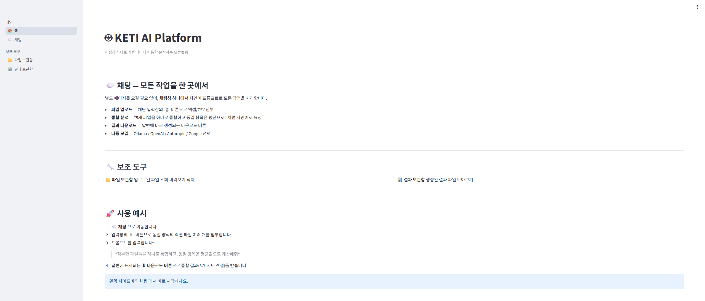
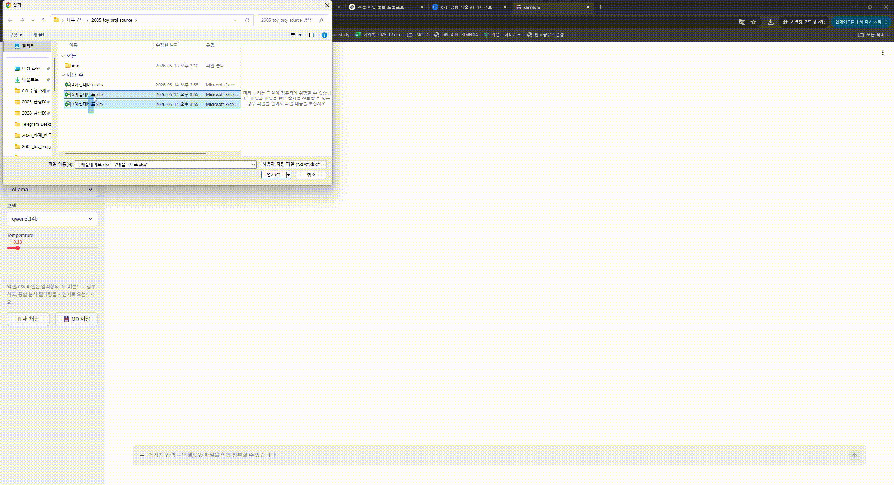
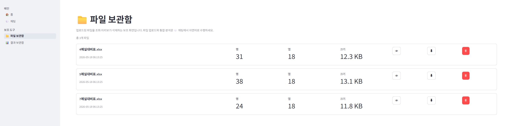
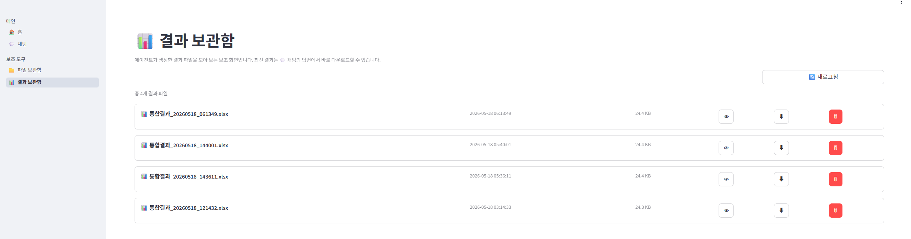

# KETI AI Platform

> 채팅창 하나로 엑셀 데이터를 통합·분석하는 Streamlit 기반 AI 플랫폼

별도 페이지를 오갈 필요 없이, **단일 채팅창에서 자연어 프롬프트만으로**
파일 업로드 → 통합·분석 → 결과 다운로드까지 모두 처리합니다.

---

## 1. 프로젝트 개요 및 실행 방법

### 개요

LangChain tool-calling 에이전트가 사용자의 자연어 요청을 해석해, 9개의 엑셀 처리
도구 중 적절한 것을 자동으로 선택·실행합니다. 사용자는 도구 이름을 몰라도 의도만
말하면 됩니다.

- **단일 채팅 인터페이스** — 업로드·통합·분석·다운로드를 채팅창 하나에서
- **다중 LLM** — Ollama(로컬) / OpenAI / Anthropic / Google
- **엑셀 통합** — 동일 양식 파일을 항목명 기준으로 통합 (3개 시트 결과)
- **인라인 다운로드** — 결과 파일을 채팅 답변에서 바로 다운로드
- **프롬프트 자동 보강** — 입력을 작업 유형에 맞는 지시로 자동 강화한 뒤 실행

### 기술 스택

| 구분 | 사용 기술 |
|---|---|
| UI | Streamlit (`st.navigation` 멀티페이지) |
| 에이전트 | LangChain tool-calling agent |
| 로컬 LLM | Ollama (기본 모델 `qwen3:14b`) |
| 클라우드 LLM | OpenAI · Anthropic · Google Gemini |
| 데이터 처리 | pandas · openpyxl |
| 배포 | Docker · docker-compose |

### 실행 방법

#### 로컬 실행

```bash
cd ~/Basic-SW-Tech

source .venv/bin/activate          # 없으면: python3 -m venv .venv
pip install -r requirements.txt

cp .env.example .env               # .env 에서 모델·API 키 설정
streamlit run app.py               # 포트
```

#### Docker 실행

```bash
docker compose up -d --build       # 컨테이너: llm_platform, 포트 
```

> ⚠️ 코드가 이미지에 구워지므로, 코드 변경 후에는 **반드시 `--build`** 로
> 재빌드해야 합니다. `--build` 없이 `up` 만 하면 옛 코드가 실행됩니다.

#### Ollama 준비

로컬 LLM을 쓰려면 호스트에서 Ollama가 실행 중이어야 합니다:
```bash
ollama serve
ollama pull qwen3:14b              # tool-calling 지원 모델 필요
```

### 접속 링크

| 환경 | 주소 |
|---|---|
| 외부 접속 | **--** |
| 로컬 | -- |

---

## 2. 주요 기능

### 💬 채팅 — 모든 작업의 중심

- **파일 첨부** — 입력창의 📎 버튼으로 엑셀/CSV 업로드
- **자연어 제어** — "5개 파일을 통합하고 동일 항목은 평균으로" 처럼 요청
- **에이전트 자동 라우팅** — Orchestrator 가 일반 대화는 LLM 직답으로,
  파일 작업은 tool_loop 로 자동 분기 (모드 토글 없음)
- **인라인 다운로드** — 결과 파일이 답변에 다운로드 버튼으로 표시되며,
  대화를 이어가도 버튼이 유지됨
- **다중 모델** — 사이드바에서 프로바이더·모델 선택

### 🔗 동일 양식 파일 통합 (핵심 기능)

여러 엑셀 파일을 **기준 컬럼(항목명)** 으로 통합합니다.

| 통합 규칙 | 처리 방식 |
|---|---|
| 동일 항목 식별 | 기준 컬럼 값이 같은 행 = 동일 항목 |
| 숫자 값 | 파일별 값의 **평균** |
| 텍스트 값 | 동일하면 유지, 다르면 **"값 상이"** |
| 누락 값 | **"N/A"** |
| 기준 컬럼 | 미지정 시 항목명 컬럼 **자동 추정** |

**출력** — 3개 시트로 구성된 단일 엑셀:
1. `통합결과` — 항목별 최종 통합 값
2. `파일별비교` — 항목 × 컬럼별 각 파일 원본값 + 통합값
3. `처리로그` — 기준 컬럼, 파일별 행수, 누락·불일치 항목

### 🛠 에이전트 현재 빌트인 기본도구 9종

| 도구 | 기능 |
|---|---|
| `list_uploaded_files` | 업로드 파일 목록 조회 |
| `read_file_preview` | 파일 구조·미리보기 (상위 20행) |
| `lookup_rows` | 특정 항목·값을 가진 행을 찾아 전체 컬럼 값 조회 |
| `merge_files_by_key` | 기준 컬럼 기반 통합 (3개 시트) |
| `merge_files_average` | 행 위치 기반 평균 병합 |
| `merge_files_concat` | 단순 이어붙이기 |
| `filter_file` | 조건부 행 필터링 |
| `aggregate_file` | 그룹별 집계 |
| `get_statistics` | 통계 요약 |

### 🪄 프롬프트 자동 보강 (Prompt Enhancer)

사용자가 입력한 일반 프롬프트를 그대로 LLM에 넘기지 않고, 작업 목적에 맞는
지시로 자동 강화한 뒤 실행합니다.

| 단계 | 처리 |
|---|---|
| 의도 분류 | 입력을 6개 작업 유형(통합·분석·필터집계·통계·일반대화·미분류)으로 분류 |
| 보강 | 유형별로 **persona·역할·처리 절차·출력 형식·제약사항**을 자동 결합 |
| 적용 | 보강된 지시를 에이전트 시스템 메시지에 주입해 실행 |
| 투명성 | 답변의 `🔍 적용된 프롬프트 보강`에서 보강 내역을 확인 가능 |

- 사이드바의 **`프롬프트 자동 보강`** 토글로 켜고 끌 수 있습니다.
- 일반 대화는 과도한 보강 없이 가볍게 처리됩니다.

### 📁 보조 화면

- **파일 보관함** — 업로드된 파일 조회·미리보기·삭제
- **결과 보관함** — 생성된 결과 파일 아카이브

### 자동 데이터 보정

- **다중 행 헤더 평탄화** — 병합된 2행 헤더를 `실행예산_이월예산` 형태로 자동 변환
- **콤마 숫자 변환** — `'54,684,000'` 같은 문자열 숫자를 자동으로 숫자형 변환

---

## 3. 사용 흐름

```
┌──────────────────────────────────────────────┐
│              💬 채팅창 하나                  │
│                                              │
│  📎 파일 첨부 ─▶ 자연어 요청 ─▶ 결과 다운로드   │
└──────────────────────────────────────────────┘
```

### 기본 시나리오

1. **💬 채팅** 페이지에서 입력창의 📎 버튼으로 동일 양식 엑셀 파일들을 첨부합니다.
2. 프롬프트를 입력합니다:
   > "첨부한 파일들을 하나로 통합하고, 동일 항목은 평균값으로 계산해줘"
3. 에이전트가 `merge_files_by_key` 도구를 자동 선택·실행합니다.
4. 답변에 표시되는 **⬇ 다운로드 버튼**으로 통합 결과(3개 시트 엑셀)를 받습니다.

### 그 외 요청 예시

- "4예실대비표.xlsx의 통계를 요약해줘" → `get_statistics`
- "계획예산이 1억 이상인 행만 추려줘" → `filter_file`
- "비목분류별로 합계를 내줘" → `aggregate_file`

---

## 4. 실행 화면

> 📷 실행 화면을 캡쳐하여 `docs/images/` 폴더에 아래 파일명으로 저장하면
> 이미지가 표시됩니다.

### 4-1. 홈 화면

<!-- 캡쳐 위치: docs/img/01_home.png -->


### 4-2. 채팅 — 파일 첨부 및 통합 요청

<!-- 캡쳐 위치: docs/img/02_chat_result.gif -->


### 4-3. 파일 보관함

<!-- 캡쳐 위치: docs/img/03_files.png -->


### 4-4. 결과 보관함

<!-- 캡쳐 위치: docs/img/04_results.png -->


---

## 5. Claude Code "Skill" 개념과 현재 구현 기능의 연관성

### Claude Code의 Skill 개념

**Skill** 은 Claude Code에서 특정 작업을 수행하기 위한 **모듈화된 능력 단위**입니다.

- **구성**: 각 스킬은 `이름(name)` + `설명(description)` + `실행 지침/스크립트` 로 구성됩니다.
- **모델 주도 호출**: 사용자가 스킬을 직접 지정하지 않아도, 모델이 요청 내용과
  각 스킬의 `description` 을 보고 **언제 어떤 스킬을 쓸지 스스로 판단**합니다.
- **확장성**: 새 스킬을 추가하면 별도 분기 코드 없이 모델이 활용합니다.

### 현재 프로젝트와의 연관성

이 프로젝트의 **엑셀 처리 에이전트**(`agent/excel_agent.py`)는 Claude Code Skill과
**동일한 설계 철학**으로 구현되어 있습니다.

| Claude Code Skill | 본 프로젝트의 구현 |
|---|---|
| Skill 단위 | `@tool` 데코레이터가 붙은 함수 (9개) |
| name + description | 함수명 + **docstring** |
| 모델 주도 호출 | LangChain **tool-calling** — LLM이 프롬프트 보고 도구 선택 |
| 스킬 사용 가이드 | `_SYSTEM_PROMPT` 의 도구 선택 가이드 |
| 스킬 등록 | `ALL_TOOLS` 리스트에 함수 추가 |

**동작 예시** — 사용자가 *"파일들을 항목명 기준으로 통합해줘"* 라고 입력하면:

1. LLM이 9개 도구의 `description`(docstring)을 검토합니다.
2. `merge_files_by_key` 의 설명이 요청과 일치한다고 판단합니다.
3. 해당 도구를 적절한 인자와 함께 **스스로 호출**합니다.
4. 결과(통합 엑셀 생성)를 받아 한국어로 설명합니다.

이는 Claude Code가 요청에 맞는 Skill을 자동 선택·실행하는 흐름과 같습니다.

### 설계적 의의

- **모듈화** — 각 기능이 독립된 도구로 분리되어 유지보수·테스트가 쉽습니다.
- **선언적 확장** — 새 기능은 `@tool` 함수 작성 후 `ALL_TOOLS`에 추가만 하면 되며,
  분기문(if/else)을 늘리지 않고 에이전트 능력을 확장합니다.
- **자연어 인터페이스** — 사용자는 도구 이름을 몰라도 의도만 말하면 모델이
  적합한 도구를 선택합니다. 이것이 Skill 기반 설계의 핵심 가치입니다.

> **Phase 3 진행 현황**: 도구가 `agent/engine/tools/builtin/` 폴더에 개별
> 파일로 분리되었고 `engine/tool_registry/registry.json` 기반 동적 로드 체계가
> 도입되어, Claude Code Skill의 폴더 기반 플러그인 구조와 더 가까워졌습니다.
> 이후 단계(`creation_pipeline` · `safety` · `sandbox`)가 추가되면 미지원
> 요청에 대해 AI가 새 도구를 자동 생성·등록하는 **self-evolving** 구조가
> 완성됩니다 — 자세한 내용은 `docs/ROADMAP.md` 참조.

---

## 프로젝트 구조

```
Basic-SW-Tech/
├── app.py                  # st.navigation 진입점 (채팅이 기본 페이지)
├── .streamlit/config.toml  # 포트 고정
├── config/
│   ├── settings.py         # 환경설정 (Pydantic)
│   └── prompt_templates.py # 작업 유형별 보강 템플릿
├── core/
│   ├── file_manager.py     # 파일 CRUD · 헤더 평탄화 · 숫자 변환
│   ├── chat_manager.py     # 채팅 세션 → Markdown
│   ├── model_manager.py    # Ollama REST API 연동
│   └── excel_processor.py  # 통합 · 병합 · 집계 · 다중 시트 저장
├── agent/
│   ├── llm_factory.py      # LLM 프로바이더 팩토리
│   ├── prompt_enhancer.py  # 프롬프트 자동 보강 (의도 분류 + 보강 엔진)
│   ├── excel_agent.py      # 호환 레이어 (registry 동적 로드 + _SYSTEM_PROMPT)
│   └── engine/             # Phase 3 모듈화 (Self-evolving 준비)
│       ├── orchestrator.py # 라우팅 (simple chat / tool_loop)
│       ├── data/loader.py  # 데이터 접근 단일 게이트웨이 + 공유 상태
│       ├── tool_registry/
│       │   ├── registry.json   # 도구 메타데이터
│       │   └── registry.py     # 동적 로드 + execute()
│       ├── tools/
│       │   ├── builtin/    # 9개 도구 (개별 파일)
│       │   └── generated/  # AI 자동 생성 도구 (Phase 3 후반)
│       ├── safety/         # AST 안전 검사 (예약)
│       └── sandbox/        # 격리 실행 환경 (예약)
├── pages/
│   ├── home.py             # 홈
│   ├── chat.py             # 채팅 (메인 작업 공간)
│   ├── files.py            # 파일 보관함 (보조)
│   └── results.py          # 결과 보관함 (보조)
├── uploads/                # 업로드 파일 저장소
├── results/                # 처리 결과 저장소
├── chats/                  # 채팅 영속화 (id.json)
└── docs/img/               # README 실행 화면 캡쳐 위치
```
